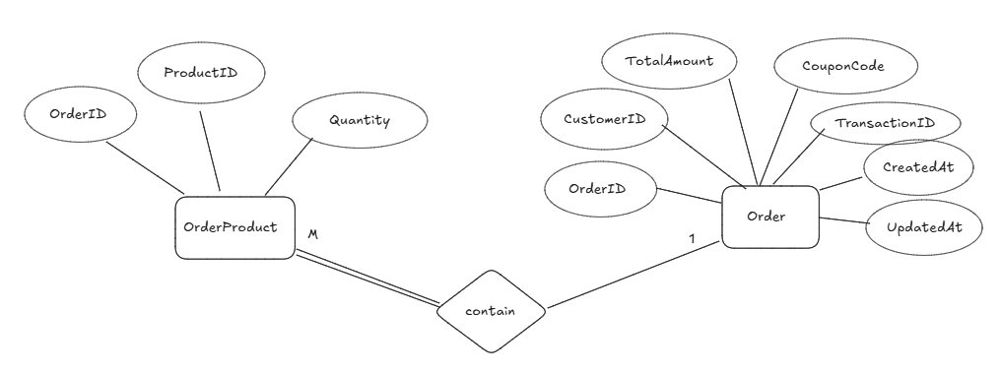
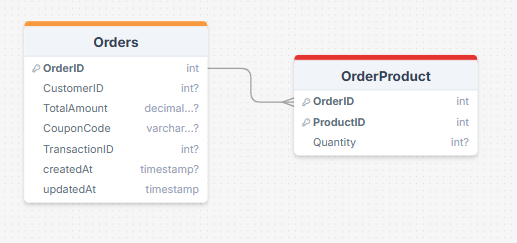

# 📦 Order Service – Microservice for Order Management

The **Order Service** is a core microservice in an e-commerce architecture. It manages customer orders, tracks order status, coordinates with other services (stock, coupon, bank), and implements the **Saga Pattern** for distributed transaction handling.

---

## ✨ Features

- Create and manage customer orders
- Track and update order status (PENDING → COMPLETED/FAILED)
- Link orders with multiple products (via `order_product` table)
- Integrated with Stock, Bank, and Coupon services
- Rollback and recovery using RabbitMQ and Saga pattern
- Pagination, filtering, sorting of orders
- Global exception handling and validation

---

## 🧠 Entity Relationship Diagram (ERD)

---

## 🗄️ Database Schema

---

| Method | Endpoint                         | Description                         |
|--------|----------------------------------|-------------------------------------|
| POST   | `/api/v1/orders`                    | Create a new order                  |
| GET    | `/api/v1/orders`                    | Paginated list of orders            |
| GET    | `/api/v1/orders/{id}`               | Get order by ID                     |
| PUT    | `/api/v1/orders/{id}/status`        | Update order status                 |
| DELETE | `/api/v1/orders/{id}`               | Delete an order                     |

> **Filtering:**
> - `/api/orders?customerId=123&status=COMPLETED&page=0&size=10&sortBy=date`

---

## 🛠️ Technologies Used

- Java 
- Spring Boot 
- Spring Data JPA + Hibernate
- PostgreSQL
- MapStruct
- RabbitMQ (Fanout Exchange for Saga)
- Docker
- Lombok
- Maven

---
